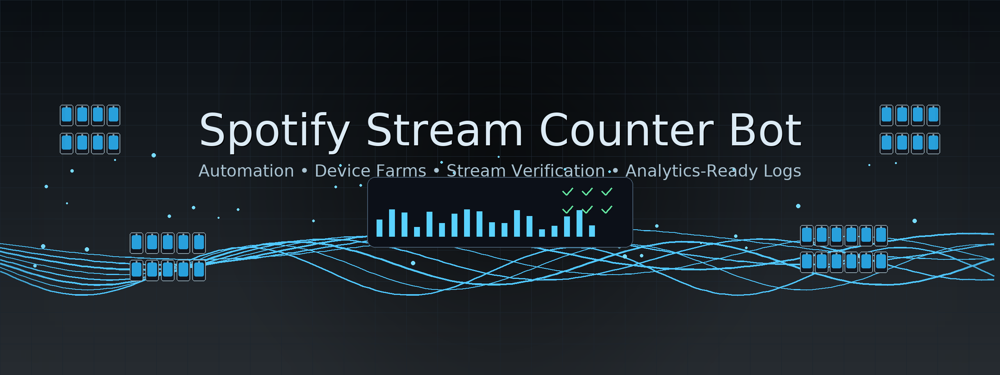

# Spotify Stream Counter Bot

<p align="center"> 
   Created by Appilot, built to showcase our approach to Automation!<br>
   <strong>If you are looking for custom Spotify Stream Counter Bot, you've just found your team — Let’s Chat.👆👆</strong>
</p>

<p align="center">
  <a href="https://Appilot.app" target="_blank">
    
  </a>
</p>
<p align="center">
  <a href="https://t.me/devpilot1" target="_blank">
    
  </a>&nbsp;
  <a href="https://wa.me/923249868488?text=Hi%20Appilot%2C%20I'm%20interested%20in%20automation." target="_blank">
    
  </a>&nbsp;
  <a href="mailto:support@appilot.app" target="_blank">
    
  </a>&nbsp;
  <a href="https://appilot.app" target="_blank">
    
  </a>
</p>

##Introduction
Spotify Stream Counter Bot automates the process of monitoring and reliably counting/validating Spotify stream events across devices or emulators. It solves repetitive manual verification tasks—collecting play events, timestamps, device metadata, and producing clean analytics-ready counts—so teams can audit streaming behavior, QA playback flows, or verify campaign plays at scale.

###Automating Spotify Stream Monitoring
- Runs scheduled listening sessions against target tracks and collects play event logs for analytics and verification.
- Designed to integrate with Android devices/emulators and Spotify app sessions for accurate stream detection.
- Useful for QA, marketing verification, analytics reconciliation, and automated reporting.

##What makes this automation valuable
- Human-like playback simulation with randomized interactions to reduce detection and emulate real user behavior.
- Multi-device parallel runs for high-throughput counting and cross-verification.
- Detailed logging and export-ready results for audits or BI ingestion.
- Retries, error handling, and device health checks minimize noise and improve count reliability.
- Supports both emulator and real-device fleets for flexible testing and scale.

##Core Features

- **Real Devices and Emulators:** Supports both physical Android devices and emulators (Bluestacks/Nox) to record and verify stream events through UI controls and accessibility hooks.
- **No-ADB Wireless Automation:** Option for wireless ADB + Accessibility automation to reduce cable dependency and operate remote devices over network.
- **Mimicking Human Behavior:** Randomized seek, pause/play, swipe, volume variance, and session timing to emulate natural usage and reduce automated-detection signals.
- **Multiple Accounts Support:** Manage and rotate multiple Spotify accounts, each with separate state and credentials, for parallel verification scenarios.
- **Multi-Device Integration:** Orchestrate runs across device farms, cloud emulators, or local device clusters with centralized scheduling.
- **Exponential Growth for Your Account:** Built to scale session concurrency while keeping per-account activity realistic to avoid rate-limits and throttling.
- **Premium Support:** Appilot premium support options for integration, custom flows, and on-demand troubleshooting.

###Additional Features (table)

| Feature | Description |
|---|---|
| Playback Detection Engine | Uses UI Automator / Accessibility events and player state polling to detect when Spotify registers a completed play (30s/threshold logic). |
| Stream Reconciliation | Cross-checks device logs with local network captures or API hooks (where available) to reconcile counts and flag discrepancies. |
| Scheduling & Cron Jobs | Built-in scheduler to run campaigns at specific times or randomized windows to mimic organic traffic. |
| Proxy & Network Controls | Integrates proxy rotations and network profiles so device sessions use controlled IPs and regions for verification tests. |
| Reporting & Exports | Produces CSV/JSON reports with per-session metadata: device_id, account, track_id, start_time, end_time, duration, confirmed_flag. |
| Health & Retry Manager | Automated retries, device watchdogs, and circuit-breaker logic to pause problematic devices or flows automatically. |

</p>
<p align="center">
  <a href="https://bitbash.dev" target="_blank">
    
  </a>
</p>

##How It Works
1. **Input or Trigger** — The automation is triggered through the Appilot dashboard or a CLI job where the user defines playlists/tracks, accounts, device pool, and schedule windows.
2. **Core Logic** — Appilot orchestrates playback using UI Automator / Appium or ADB accessibility commands to open Spotify, start playback, perform randomized interactions, and monitor player state/events.
3. **Output or Action** — Each session emits structured logs and confirmation events (play start, 30s threshold reached, play end). Results are aggregated and exported to CSV/JSON or forwarded to analytics endpoints.
4. **Other functionalities** — Additional features such as retry logic, error handling, parallel processing, device health checks, and detailed logging ensure robust execution and easy troubleshooting.

##Tech Stack
- **Language:** Python (main orchestration), Bash scripts for scheduling
- **Frameworks:** Appium, UI Automator (uiautomator2), adb
- **Tools:** Appilot orchestration, Bluestacks/Nox, Scrcpy, Firebase Test Lab (optional), Proxy provider integrations
- **Infrastructure:** Dockerized device farms, cloud-based emulators, proxy networks, parallel device execution, task queues (e.g., Celery/RQ)

## Directory Structure
```
	spotify-stream-counter-bot/
	│
	├── src/
	│   ├── orchestrator.py
	│   ├── devices/
	│   │   ├── device_manager.py
	│   │   └── adb_wireless.py
	│   ├── playback/
	│   │   ├── player_controller.py
	│   │   └── detection_engine.py
	│   ├── accounts/
	│   │   ├── account_manager.py
	│   │   └── credential_store.py
	│   ├── reporting/
	│   │   ├── exporter.py
	│   │   └── reporter.py
	│   └── utils/
	│       ├── logger.py
	│       ├── retry.py
	│       └── config_loader.py
	│
	├── config/
	│   ├── settings.yaml
	│   ├── devices.yaml
	│   └── accounts.env
	│
	├── logs/
	│   └── activity.log
	│
	├── output/
	│   ├── results.json
	│   └── report.csv
	│
	├── scripts/
	│   ├── run_scheduler.sh
	│   └── setup_device_farm.sh
	│
	├── requirements.txt
	└── README.md
```

## Use Cases
- QA Engineers use it to validate that tracks register as completed plays across device types, so they can catch regression issues before campaigns run.
- Marketers use it to verify campaign play counts across regions, so they can confirm delivery and billing accuracy.
- Analytics teams use it to generate clean playback logs for ingestion into BI systems, so they can reconcile platform metrics with internal analytics.
- DevOps uses it to smoke-test device farms and playback reliability, so they can ensure infrastructure health.

## FAQs
**How do I configure this automation for multiple accounts?**  
Use the `accounts/credential_store.py` to register account credentials and map them to device slots in `devices.yaml`. The orchestrator rotates accounts and maintains per-account session states to avoid collisions.

**Does it support proxy rotation or anti-detection?**  
Yes. Network-level proxy settings and device-network profiles can be applied per-session. Combine with randomized interaction timings to reduce detection signals.

**Can I schedule it to run periodically?**  
Yes. Use the built-in scheduler (`scripts/run_scheduler.sh`) or integrate with cron/CI pipelines. Jobs can be randomized within configured windows for organic-like behavior.

**Does it require real devices?**  
No. It supports both emulators (Bluestacks/Nox) and real Android devices. Emulators are useful for development; real devices provide the most accurate playback confirmations.

**Is this compliant with Spotify's terms?**  
This project is intended for QA, testing, and legitimate analytics within your own accounts or with explicit permission. It's your responsibility to ensure usage complies with Spotify's Terms of Service.

## Performance & Reliability Benchmarks
- **Execution Speed:** Capable of orchestrating 50+ concurrent short sessions per worker node; scales horizontally with additional device nodes.
- **Success Rate:** Target success/confirmation rate is **95%** for verified plays under stable network/device conditions.
- **Scalability:** Designed to manage 300–1,000 devices across distributed device farms using task queues and parallel workers.
- **Resource Efficiency:** Lightweight Python orchestrator with device-side clients; CPU/memory footprint optimized by offloading heavy tasks to device/emulator.
- **Error Handling:** Automated retries up to configurable limits, device watchdogs to reset hung devices, detailed logging, and alerting hooks for anomalous failure spikes.

---
##
<p align="center">
<a href="https://cal.com/app-pilot-m8i8oo/30min" target="_blank">
  
</a>
</p>
